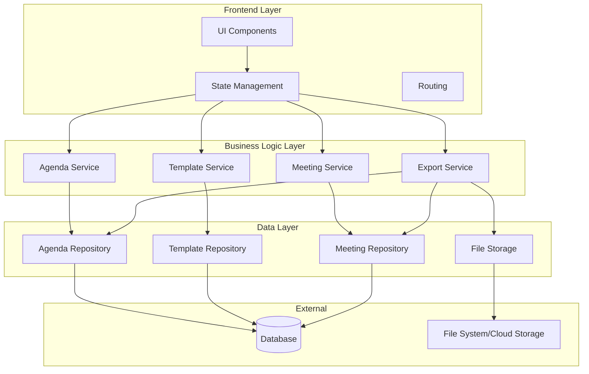

# Design Document: Ward Agenda Builder

## Overview

The Ward Agenda Builder is a responsive web module within the Ward Manager application that enables ward leaders to create, manage, and customize meeting agendas using configurable templates. The system follows a modern web architecture with a clear separation between frontend presentation, business logic, and data persistence layers.

### Key Design Principles

- **Responsive-First Design**: Mobile-first CSS approach ensuring optimal experience across all device sizes
- **Component-Based Architecture**: Reusable UI components for maintainability and consistency
- **Data Integrity**: Structured data models with validation to ensure reliable agenda and meeting management
- **Extensibility**: Template system designed to accommodate diverse ward needs and future enhancements
- **User Experience**: Intuitive workflows that minimize clicks and cognitive load for busy ward leaders

## Architecture

### High-Level Architecture



### Technology Stack

**Backend:**
- Runtime: Node.js (LTS version)
- Framework: NestJS (modular architecture, TypeScript-first, built-in dependency injection)
- Language: TypeScript (strict mode)
- Database: PostgreSQL (relational data, ACID compliance, JSON support)
- ORM: TypeORM or Prisma (type-safe database access)
- File Storage: AWS S3 or local file system with multer
- PDF Generation: PDFKit or Puppeteer
- Validation: class-validator and class-transformer
- API: RESTful endpoints

**Frontend:**
- Framework: React 18+ with TypeScript
- Build Tool: Vite (fast development and optimized builds)
- State Management: React Context API + hooks (or Zustand for complex state)
- Routing: React Router v6
- HTTP Client: Axios (with interceptors for auth)
- UI Components: Material-UI (MUI) or Tailwind CSS + Headless UI
- Form Handling: React Hook Form with Zod validation
- Date/Time: date-fns or Day.js
- Drag & Drop: react-beautiful-dnd or dnd-kit
- Rich Text Editor: TipTap or Slate.js (for minutes)

**Development & Testing:**
- Testing Framework: Jest (unit tests) + React Testing Library
- E2E Testing: Playwright or Cypress
- API Testing: Supertest
- Code Quality: ESLint + Prettier

**Integration:**
- Authentication: Integrates with Ward Manager Auth module via JWT tokens
- Authorization: Uses Ward Manager permission system for module access control

### Module Structure

```
ward-agenda-builder/
├── components/          # UI components
│   ├── agenda/         # Agenda-related components
│   ├── template/       # Template management components
│   ├── meeting/        # Meeting scheduling components
│   └── shared/         # Reusable UI elements
├── services/           # Business logic services
├── repositories/       # Data access layer
├── models/            # Data models and types
├── utils/             # Utility functions
└── hooks/             # Custom React hooks (if using React)
```

## Components and Interfaces

### Core Components

#### 1. Template Management Components

**TemplateList**
- Displays all available templates organized by meeting type
- Supports filtering and search
- Provides actions: create, edit, duplicate, delete

**TemplateEditor**
- Form for creating/editing templates
- Drag-and-drop interface for reordering agenda items
- Dynamic field management for custom agenda item properties
- Real-time validation and preview

**TemplateSelector**
- Modal or dropdown for selecting a template when creating a new agenda
- Groups templates by meeting type
- Shows template preview on hover/selection

#### 2. Agenda Management Components

**AgendaList**
- Calendar or list view of scheduled meetings
- Filtering by date range, meeting type, or status
- Quick actions: view, edit, duplicate, export

**AgendaEditor**
- Main interface for creating/editing agendas
- Sections:
  - Meeting details (date, time, location)
  - Attendee management
  - Agenda items with inline editing
  - Time allocation display with total duration
  - Minutes section (text input or file upload)
- Auto-save functionality
- Visual indicators for time overruns

**AgendaItemEditor**
- Inline or modal editor for individual agenda items
- Dynamic fields based on template configuration
- Time duration picker
- Validation for required fields

#### 3. Meeting Components

**MeetingScheduler**
- Date/time picker with timezone support
- Location input with autocomplete (if integrated with ward directory)
- Attendee selector with search/filter capabilities

**AttendeeManager**
- List of attendees with add/remove functionality
- Search interface for adding attendees from ward directory
- Manual entry for guests or external attendees

**MinutesEditor**
- Rich text editor for inline minutes
- File upload interface with drag-and-drop
- Preview for uploaded documents
- Download functionality for attached files

#### 4. Export Components

**ExportDialog**
- Single agenda export with format selection (PDF)
- Preview before export
- Print-friendly layout options

**BulkExportDialog**
- Date range selector
- Meeting type filter
- Export format selection (JSON, CSV, ZIP with PDFs)
- Progress indicator for large exports

### Service Layer Interfaces

#### AgendaService

```typescript
interface AgendaService {
  createAgenda(templateId: string, meetingDetails: MeetingDetails): Promise<Agenda>
  getAgenda(agendaId: string): Promise<Agenda>
  updateAgenda(agendaId: string, updates: Partial<Agenda>): Promise<Agenda>
  deleteAgenda(agendaId: string): Promise<void>
  listAgendas(filters: AgendaFilters): Promise<Agenda[]>
  duplicateAgenda(agendaId: string): Promise<Agenda>
  calculateTotalDuration(agendaItems: AgendaItem[]): number
}
```

#### TemplateService

```typescript
interface TemplateService {
  createTemplate(template: TemplateInput): Promise<Template>
  getTemplate(templateId: string): Promise<Template>
  updateTemplate(templateId: string, updates: Partial<Template>): Promise<Template>
  deleteTemplate(templateId: string): Promise<void>
  listTemplates(meetingType?: string): Promise<Template[]>
  duplicateTemplate(templateId: string, newName: string): Promise<Template>
}
```

#### MeetingService

```typescript
interface MeetingService {
  scheduleMeeting(agendaId: string, details: MeetingDetails): Promise<Meeting>
  updateMeeting(meetingId: string, updates: Partial<MeetingDetails>): Promise<Meeting>
  addAttendee(meetingId: string, attendee: Attendee): Promise<void>
  removeAttendee(meetingId: string, attendeeId: string): Promise<void>
  addMinutes(meetingId: string, minutes: string | File): Promise<void>
  getMinutes(meetingId: string): Promise<Minutes>
}
```

#### ExportService

```typescript
interface ExportService {
  exportAgendaToPDF(agendaId: string, options: ExportOptions): Promise<Blob>
  bulkExport(filters: ExportFilters): Promise<Blob>
  generateBackup(filters: BackupFilters): Promise<Blob>
}
```

## Data Models

### Template

```typescript
interface Template {
  id: string
  name: string
  meetingType: string
  description?: string
  items: TemplateItem[]
  createdAt: Date
  updatedAt: Date
  createdBy: string
}

interface TemplateItem {
  id: string
  order: number
  label: string
  fields: FieldDefinition[]
  defaultDuration?: number // in minutes
}

interface FieldDefinition {
  name: string
  type: 'text' | 'number' | 'textarea' | 'select'
  label: string
  required: boolean
  options?: string[] // for select type
  defaultValue?: any
}
```

### Agenda

```typescript
interface Agenda {
  id: string
  templateId: string
  meetingId: string
  items: AgendaItem[]
  status: 'draft' | 'published' | 'completed'
  createdAt: Date
  updatedAt: Date
  createdBy: string
}

interface AgendaItem {
  id: string
  templateItemId: string
  order: number
  label: string
  fieldValues: Record<string, any>
  duration?: number // in minutes
}
```

### Meeting

```typescript
interface Meeting {
  id: string
  agendaId: string
  date: Date
  startTime: string // HH:MM format
  location: string
  attendees: Attendee[]
  minutes?: Minutes
  createdAt: Date
  updatedAt: Date
}

interface Attendee {
  id: string
  name: string
  email?: string
  role?: string
}

interface Minutes {
  id: string
  meetingId: string
  content?: string // text-based minutes
  fileUrl?: string // uploaded file reference
  fileName?: string
  fileType?: string
  createdAt: Date
  updatedBy: string
}
```

### Supporting Types

```typescript
interface MeetingDetails {
  date: Date
  startTime: string
  location: string
  attendees?: Attendee[]
}

interface AgendaFilters {
  startDate?: Date
  endDate?: Date
  meetingType?: string
  status?: string
}

interface ExportOptions {
  includeMinutes: boolean
  includeAttendees: boolean
  layout: 'compact' | 'detailed'
}

interface ExportFilters {
  startDate?: Date
  endDate?: Date
  meetingTypes?: string[]
  format: 'json' | 'csv' | 'pdf-zip'
}

interface BackupFilters extends ExportFilters {
  includeMinutes: boolean
  includeAttachments: boolean
}
```

## Error Handling

### Error Categories

1. **Validation Errors**: Invalid input data (e.g., missing required fields, invalid date formats)
2. **Not Found Errors**: Requested resource doesn't exist
3. **Permission Errors**: User lacks authorization for the operation
4. **Storage Errors**: File upload/download failures
5. **Export Errors**: PDF generation or bulk export failures
6. **Network Errors**: API communication failures

### Error Handling Strategy

```typescript
interface AppError {
  code: string
  message: string
  details?: any
  userMessage: string // User-friendly message for display
}

class ErrorHandler {
  handle(error: AppError): void {
    // Log error for debugging
    console.error(error)
    
    // Display user-friendly message
    this.showNotification(error.userMessage)
    
    // Track error for monitoring (if analytics enabled)
    this.trackError(error)
  }
  
  private showNotification(message: string): void {
    // Display toast or alert to user
  }
  
  private trackError(error: AppError): void {
    // Send to error tracking service
  }
}
```

### Validation Rules

- **Template Name**: Required, 1-100 characters, unique within meeting type
- **Meeting Date**: Required, cannot be more than 2 years in the past
- **Meeting Time**: Required, valid HH:MM format
- **Location**: Required, 1-200 characters
- **Attendee Name**: Required, 1-100 characters
- **Agenda Item Duration**: Optional, 1-999 minutes
- **Minutes File**: Max 10MB, allowed types: PDF, DOCX, TXT
- **Custom Field Values**: Validated based on field definition type and constraints

## Testing Strategy

### Unit Testing

**Target Coverage**: 80% minimum

**Key Areas**:
- Service layer business logic
- Data model validation
- Utility functions (date formatting, duration calculations)
- Repository methods

**Testing Approach**:
- Mock external dependencies (database, file storage)
- Test edge cases and error conditions
- Validate data transformations

### Integration Testing

**Key Scenarios**:
- Template creation and agenda generation workflow
- Meeting scheduling with attendee management
- Minutes upload and retrieval
- Export functionality (single and bulk)
- Template duplication and modification

**Testing Approach**:
- Use test database with seed data
- Test API endpoints with realistic payloads
- Verify data persistence and retrieval
- Test file upload/download flows

### End-to-End Testing

**Critical User Flows**:
1. Create template → Create agenda from template → Schedule meeting → Add attendees → Export PDF
2. Edit existing template → Create new agenda → Verify changes reflected
3. Add minutes (text and file) → Retrieve and view minutes
4. Bulk export with filters → Verify export contents
5. Responsive behavior across device sizes

**Testing Tools**:
- Browser automation (Playwright, Cypress, or similar)
- Visual regression testing for responsive layouts
- Accessibility testing (WCAG 2.1 AA compliance)

### Performance Testing

**Metrics to Monitor**:
- Page load time < 2 seconds on 3G connection
- Agenda list rendering with 100+ items < 500ms
- PDF export generation < 5 seconds for typical agenda
- Bulk export of 50 meetings < 30 seconds
- File upload progress feedback for files > 1MB

## Responsive Design Specifications

### Breakpoints

- **Mobile**: < 768px
- **Tablet**: 768px - 1023px
- **Desktop**: ≥ 1024px

### Layout Adaptations

**Mobile (< 768px)**:
- Single column layout
- Hamburger menu for navigation
- Stacked form fields
- Bottom sheet for modals
- Touch-optimized buttons (min 44x44px)
- Simplified agenda item cards

**Tablet (768px - 1023px)**:
- Two-column layout where appropriate
- Side drawer navigation
- Inline form fields with labels
- Standard modals
- Agenda list with preview pane

**Desktop (≥ 1024px)**:
- Multi-column layouts
- Persistent sidebar navigation
- Inline editing with hover states
- Large modals with detailed forms
- Split view for agenda editing (list + detail)

### Touch and Interaction Considerations

- Drag-and-drop for reordering (with fallback for mobile)
- Swipe gestures for mobile navigation
- Keyboard shortcuts for power users on desktop
- Focus management for accessibility
- Loading states and skeleton screens

## Security Considerations

### Authentication and Authorization

- User authentication handled by parent Ward Manager application
- Role-based access control for template and agenda management
- Ward-level data isolation (users only see their ward's data)

### Data Protection

- Input sanitization to prevent XSS attacks
- SQL injection prevention through parameterized queries
- File upload validation (type, size, content scanning)
- Secure file storage with access controls

### Privacy

- No sensitive personal information in agendas by default
- Optional encryption for minutes containing sensitive discussions
- Audit logging for data access and modifications
- GDPR/privacy compliance for attendee data

## Future Enhancements

Potential features for future iterations:
- Email notifications for scheduled meetings
- Calendar integration (Google Calendar, Outlook)
- Collaborative editing with real-time updates
- Template marketplace or sharing between wards
- Mobile native apps for offline access
- AI-assisted agenda generation based on historical patterns
- Integration with ward directory for attendee management
- Recurring meeting support
- Meeting analytics and insights
