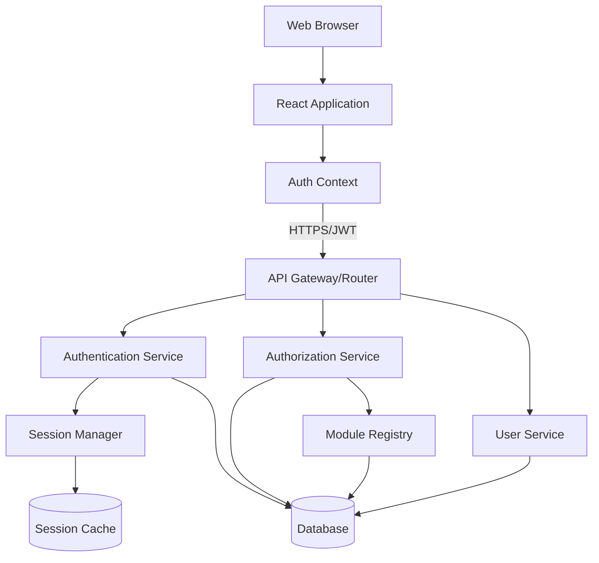
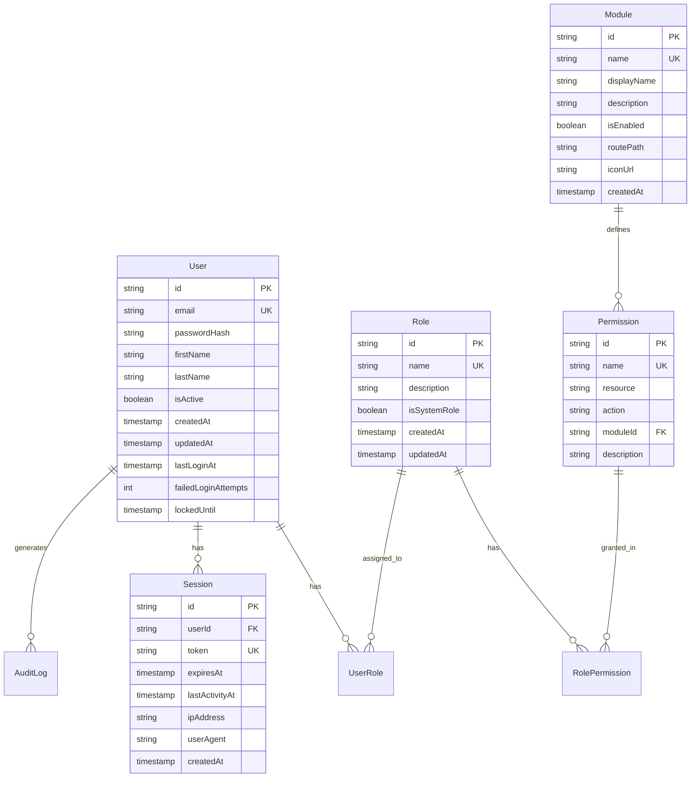
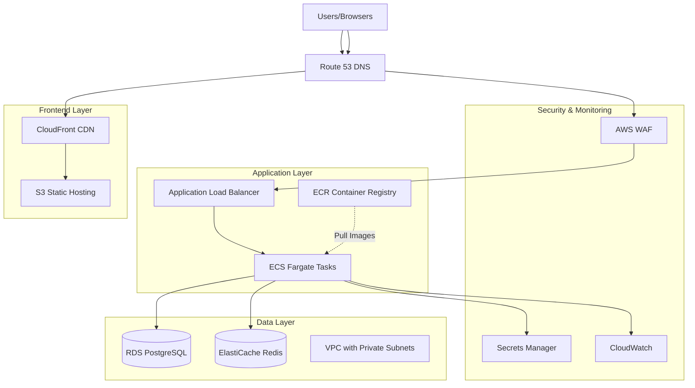

# Ward Manager Authentication & Authorization System Design

## Overview

The Ward Manager authentication and authorization system provides a secure, scalable foundation for managing user access across multiple modules. The system implements a role-based access control (RBAC) model with module-level permissions, session management, and comprehensive security features.

The architecture follows a layered approach with clear separation between authentication (verifying identity), authorization (checking permissions), and session management. This design enables the Ward Manager to serve as a centralized access control platform for current and future modules.

## Architecture

### High-Level Architecture



### Technology Stack Considerations

**Backend:**
- Backend Framework: Node.js with Express or NestJS (modular, scalable)
- Database: Amazon RDS for PostgreSQL (managed, ACID compliance, automated backups)
- Session Store: Amazon ElastiCache for Redis (managed, distributed session management)
- Password Hashing: bcrypt or Argon2
- Token Management: JWT (JSON Web Tokens) for stateless authentication
- API Security: Helmet.js, CORS configuration, rate limiting
- Compute: Amazon ECS with Fargate for containerized deployment
- Container Registry: Amazon ECR for Docker image storage

**Frontend:**
- Frontend Framework: React with TypeScript (component-based, type-safe)
- State Management: React Context API or Redux for auth state
- Routing: React Router for navigation between modules
- UI Components: Material-UI or similar component library
- Form Handling: React Hook Form with validation
- HTTP Client: Axios with interceptors for token management
- Hosting: Amazon S3 + CloudFront for static asset delivery

**AWS Infrastructure:**
- Compute: Amazon ECS with Fargate launch type (serverless containers)
- Load Balancer: Application Load Balancer (ALB) for traffic distribution
- Container Registry: Amazon ECR for Docker image storage
- Database: Amazon RDS PostgreSQL with Multi-AZ deployment
- Cache: Amazon ElastiCache for Redis cluster
- Storage: Amazon S3 for static assets and file storage
- CDN: Amazon CloudFront for global content delivery
- Secrets: AWS Secrets Manager for credentials and keys
- Monitoring: Amazon CloudWatch for logs and metrics
- Security: AWS WAF for web application firewall, AWS Shield for DDoS protection

## Components and Interfaces

### 1. Authentication Service

Handles user identity verification and credential management.

**Responsibilities:**
- Validate user credentials
- Hash and verify passwords
- Generate authentication tokens
- Handle login/logout operations
- Manage password reset flows

**Key Methods:**
```typescript
interface AuthenticationService {
  login(credentials: LoginCredentials): Promise<AuthResult>
  logout(sessionToken: string): Promise<void>
  validateToken(token: string): Promise<TokenValidation>
  refreshToken(token: string): Promise<AuthResult>
  hashPassword(password: string): Promise<string>
  verifyPassword(password: string, hash: string): Promise<boolean>
}
```

**Security Features:**
- Rate limiting on login attempts (max 5 attempts per 15 minutes per IP)
- Account lockout after failed attempts
- Secure password requirements (min 8 chars, complexity rules)
- Password hashing with salt using bcrypt (cost factor 12)

### 2. Authorization Service

Manages permissions and access control decisions.

**Responsibilities:**
- Check user permissions for modules and actions
- Evaluate role-based access rules
- Provide permission queries for UI rendering
- Cache permission lookups for performance

**Key Methods:**
```typescript
interface AuthorizationService {
  checkModuleAccess(userId: string, moduleId: string): Promise<boolean>
  checkPermission(userId: string, resource: string, action: string): Promise<boolean>
  getUserPermissions(userId: string): Promise<Permission[]>
  getUserModules(userId: string): Promise<Module[]>
  evaluateRoles(userId: string): Promise<Role[]>
}
```

**Permission Model:**
- Permissions are defined as: `module:resource:action` (e.g., `agenda-builder:meeting:create`)
- Roles aggregate multiple permissions
- Users can have multiple roles
- Permissions are inherited from all assigned roles

### 3. Session Manager

Handles session lifecycle and token management.

**Responsibilities:**
- Create and destroy sessions
- Validate active sessions
- Implement session timeout and renewal
- Track session activity
- Manage session storage

**Key Methods:**
```typescript
interface SessionManager {
  createSession(userId: string, metadata: SessionMetadata): Promise<Session>
  getSession(sessionToken: string): Promise<Session | null>
  refreshSession(sessionToken: string): Promise<Session>
  destroySession(sessionToken: string): Promise<void>
  cleanupExpiredSessions(): Promise<void>
}
```

**Session Configuration:**
- Default timeout: 30 minutes of inactivity
- Maximum session duration: 12 hours
- Activity-based renewal: extends timeout on each request
- Session warning: notify user 5 minutes before expiration

### 4. User Service

Manages user account data and operations.

**Responsibilities:**
- CRUD operations for user accounts
- User profile management
- User-role associations
- Account activation/deactivation
- Audit logging

**Key Methods:**
```typescript
interface UserService {
  createUser(userData: CreateUserDto): Promise<User>
  getUserById(userId: string): Promise<User | null>
  getUserByEmail(email: string): Promise<User | null>
  updateUser(userId: string, updates: UpdateUserDto): Promise<User>
  deactivateUser(userId: string): Promise<void>
  assignRole(userId: string, roleId: string): Promise<void>
  removeRole(userId: string, roleId: string): Promise<void>
}
```

### 5. Role & Permission Service

Manages roles and permission definitions.

**Responsibilities:**
- Define and manage roles
- Define and manage permissions
- Associate permissions with roles
- Provide default role templates

**Key Methods:**
```typescript
interface RolePermissionService {
  createRole(roleData: CreateRoleDto): Promise<Role>
  updateRole(roleId: string, updates: UpdateRoleDto): Promise<Role>
  deleteRole(roleId: string): Promise<void>
  assignPermissionToRole(roleId: string, permissionId: string): Promise<void>
  removePermissionFromRole(roleId: string, permissionId: string): Promise<void>
  getPermissionsByRole(roleId: string): Promise<Permission[]>
}
```

### 6. Module Registry

Tracks available modules and their permission requirements.

**Responsibilities:**
- Register modules in the system
- Define module-specific permissions
- Provide module metadata
- Enable/disable modules

**Key Methods:**
```typescript
interface ModuleRegistry {
  registerModule(moduleData: ModuleRegistration): Promise<Module>
  getModule(moduleId: string): Promise<Module | null>
  listModules(): Promise<Module[]>
  getModulePermissions(moduleId: string): Promise<Permission[]>
  updateModuleStatus(moduleId: string, enabled: boolean): Promise<void>
}
```

### 7. Audit Logger

Records security-relevant events for compliance and troubleshooting.

**Responsibilities:**
- Log authentication events
- Log authorization decisions
- Log user management actions
- Provide audit trail queries

**Key Methods:**
```typescript
interface AuditLogger {
  logAuthEvent(event: AuthEvent): Promise<void>
  logAccessAttempt(attempt: AccessAttempt): Promise<void>
  logUserChange(change: UserChangeEvent): Promise<void>
  queryAuditLog(filters: AuditFilters): Promise<AuditEntry[]>
}
```

## Frontend Components and Architecture

### UI Component Structure

```
src/
├── components/
│   ├── auth/
│   │   ├── LoginForm.tsx
│   │   ├── SessionExpiryModal.tsx
│   │   └── ProtectedRoute.tsx
│   ├── layout/
│   │   ├── AppLayout.tsx
│   │   ├── Navigation.tsx
│   │   └── ModuleDashboard.tsx
│   └── admin/
│       ├── UserManagement/
│       │   ├── UserList.tsx
│       │   ├── UserForm.tsx
│       │   └── UserRoleAssignment.tsx
│       ├── RoleManagement/
│       │   ├── RoleList.tsx
│       │   ├── RoleForm.tsx
│       │   └── PermissionSelector.tsx
│       └── ModuleManagement/
│           ├── ModuleList.tsx
│           └── ModuleForm.tsx
├── contexts/
│   └── AuthContext.tsx
├── hooks/
│   ├── useAuth.ts
│   ├── usePermissions.ts
│   └── useSession.ts
├── services/
│   ├── authService.ts
│   ├── userService.ts
│   └── apiClient.ts
└── types/
    ├── auth.types.ts
    └── user.types.ts
```

### 8. Authentication Components

**LoginForm Component**

Handles user authentication interface.

**Responsibilities:**
- Render email and password input fields
- Validate form inputs before submission
- Display authentication errors
- Handle login submission
- Redirect to dashboard on success

**Props & State:**
```typescript
interface LoginFormProps {
  onLoginSuccess: (user: User) => void
}

interface LoginFormState {
  email: string
  password: string
  error: string | null
  isLoading: boolean
}
```

**SessionExpiryModal Component**

Warns users about session expiration.

**Responsibilities:**
- Display modal 5 minutes before session expires
- Show countdown timer
- Provide "Extend Session" button
- Provide "Logout" button
- Auto-logout on expiration

**Props:**
```typescript
interface SessionExpiryModalProps {
  expiresAt: Date
  onExtend: () => Promise<void>
  onLogout: () => void
}
```

**ProtectedRoute Component**

Wraps routes requiring authentication.

**Responsibilities:**
- Check if user is authenticated
- Redirect to login if not authenticated
- Verify user has required permissions
- Render child components if authorized

**Props:**
```typescript
interface ProtectedRouteProps {
  children: React.ReactNode
  requiredPermission?: string
  requiredModule?: string
}
```

### 9. Layout Components

**AppLayout Component**

Main application layout wrapper.

**Responsibilities:**
- Render navigation header
- Display user info and logout button
- Provide module navigation
- Render child content area

**ModuleDashboard Component**

Displays available modules to user.

**Responsibilities:**
- Fetch user's accessible modules
- Render module cards with icons and descriptions
- Handle module navigation on click
- Filter modules based on permissions

**Props:**
```typescript
interface ModuleDashboardProps {
  modules: Module[]
  onModuleSelect: (moduleId: string) => void
}
```

**Navigation Component**

Top navigation bar.

**Responsibilities:**
- Display Ward Manager branding
- Show current user name
- Provide logout functionality
- Show module switcher dropdown

### 10. Administration Components

**UserList Component**

Displays list of all users with management actions.

**Responsibilities:**
- Fetch and display paginated user list
- Provide search and filter functionality
- Show user status (active/inactive)
- Provide edit and deactivate actions
- Navigate to user detail/edit forms

**Props:**
```typescript
interface UserListProps {
  onUserSelect: (userId: string) => void
  onUserCreate: () => void
}
```

**UserForm Component**

Form for creating and editing users.

**Responsibilities:**
- Render form fields (email, first name, last name, password)
- Validate form inputs
- Handle form submission
- Display validation errors
- Support both create and edit modes

**Props:**
```typescript
interface UserFormProps {
  userId?: string
  onSave: (userData: CreateUserDto | UpdateUserDto) => Promise<void>
  onCancel: () => void
}
```

**UserRoleAssignment Component**

Interface for assigning roles to users.

**Responsibilities:**
- Display available roles with checkboxes
- Show currently assigned roles
- Handle role assignment/removal
- Save changes to backend

**Props:**
```typescript
interface UserRoleAssignmentProps {
  userId: string
  currentRoles: Role[]
  availableRoles: Role[]
  onSave: (roleIds: string[]) => Promise<void>
}
```

**RoleList Component**

Displays list of roles with management actions.

**Responsibilities:**
- Fetch and display all roles
- Indicate system roles (non-deletable)
- Provide edit and delete actions
- Navigate to role detail/edit forms

**RoleForm Component**

Form for creating and editing roles.

**Responsibilities:**
- Render role name and description fields
- Display permission selector
- Handle form submission
- Support both create and edit modes

**PermissionSelector Component**

Interface for selecting permissions for a role.

**Responsibilities:**
- Display permissions grouped by module
- Show checkboxes for each permission
- Handle permission selection
- Display permission descriptions

**Props:**
```typescript
interface PermissionSelectorProps {
  selectedPermissions: string[]
  availablePermissions: Permission[]
  onChange: (permissionIds: string[]) => void
}
```

**ModuleList Component**

Displays registered modules with management actions.

**Responsibilities:**
- Fetch and display all modules
- Show module enabled/disabled status
- Provide toggle for enabling/disabling modules
- Provide edit action for module details

### 11. Context and State Management

**AuthContext**

Provides authentication state throughout the application.

**State:**
```typescript
interface AuthContextState {
  user: User | null
  isAuthenticated: boolean
  isLoading: boolean
  permissions: Permission[]
  modules: Module[]
  login: (credentials: LoginCredentials) => Promise<void>
  logout: () => Promise<void>
  refreshSession: () => Promise<void>
  checkPermission: (permission: string) => boolean
  hasModuleAccess: (moduleId: string) => boolean
}
```

**Implementation:**
- Manages authentication state globally
- Persists auth token in secure storage
- Provides auth methods to all components
- Handles token refresh automatically
- Clears state on logout

### 12. Custom Hooks

**useAuth Hook**

Provides access to authentication context.

```typescript
function useAuth(): AuthContextState {
  const context = useContext(AuthContext)
  if (!context) {
    throw new Error('useAuth must be used within AuthProvider')
  }
  return context
}
```

**usePermissions Hook**

Simplifies permission checking in components.

```typescript
function usePermissions() {
  const { permissions, checkPermission } = useAuth()
  
  return {
    permissions,
    can: (permission: string) => checkPermission(permission),
    canAny: (permissions: string[]) => permissions.some(checkPermission),
    canAll: (permissions: string[]) => permissions.every(checkPermission)
  }
}
```

**useSession Hook**

Manages session monitoring and expiry warnings.

```typescript
function useSession() {
  const { refreshSession, logout } = useAuth()
  const [expiresAt, setExpiresAt] = useState<Date | null>(null)
  const [showWarning, setShowWarning] = useState(false)
  
  // Monitor session expiry and show warning
  // Auto-refresh on activity
  
  return {
    expiresAt,
    showWarning,
    extendSession: refreshSession,
    endSession: logout
  }
}
```

### 13. API Service Layer

**authService**

Handles authentication API calls.

```typescript
interface AuthService {
  login(credentials: LoginCredentials): Promise<AuthResponse>
  logout(): Promise<void>
  refreshToken(): Promise<AuthResponse>
  getCurrentUser(): Promise<User>
}
```

**userService**

Handles user management API calls.

```typescript
interface UserService {
  getUsers(filters?: UserFilters): Promise<User[]>
  getUserById(id: string): Promise<User>
  createUser(data: CreateUserDto): Promise<User>
  updateUser(id: string, data: UpdateUserDto): Promise<User>
  deactivateUser(id: string): Promise<void>
  assignRole(userId: string, roleId: string): Promise<void>
  removeRole(userId: string, roleId: string): Promise<void>
}
```

**apiClient**

Centralized HTTP client with interceptors.

**Features:**
- Automatically attach auth token to requests
- Handle token refresh on 401 responses
- Redirect to login on authentication failure
- Handle rate limiting responses
- Provide consistent error handling

## Data Models

### User

```typescript
interface User {
  id: string
  email: string
  passwordHash: string
  firstName: string
  lastName: string
  isActive: boolean
  createdAt: Date
  updatedAt: Date
  lastLoginAt: Date | null
  failedLoginAttempts: number
  lockedUntil: Date | null
}
```

### Role

```typescript
interface Role {
  id: string
  name: string
  description: string
  isSystemRole: boolean  // Cannot be deleted if true
  createdAt: Date
  updatedAt: Date
}
```

### Permission

```typescript
interface Permission {
  id: string
  name: string
  resource: string  // e.g., "meeting", "user"
  action: string    // e.g., "create", "read", "update", "delete"
  moduleId: string
  description: string
}
```

### Session

```typescript
interface Session {
  id: string
  userId: string
  token: string
  expiresAt: Date
  lastActivityAt: Date
  ipAddress: string
  userAgent: string
  createdAt: Date
}
```

### Module

```typescript
interface Module {
  id: string
  name: string
  displayName: string
  description: string
  isEnabled: boolean
  routePath: string
  iconUrl: string | null
  createdAt: Date
}
```

### UserRole (Join Table)

```typescript
interface UserRole {
  userId: string
  roleId: string
  assignedAt: Date
  assignedBy: string
}
```

### RolePermission (Join Table)

```typescript
interface RolePermission {
  roleId: string
  permissionId: string
  grantedAt: Date
}
```

### AuditLog

```typescript
interface AuditLog {
  id: string
  eventType: string  // "login", "logout", "access_denied", "user_created", etc.
  userId: string | null
  targetUserId: string | null
  resourceType: string | null
  resourceId: string | null
  action: string
  result: "success" | "failure"
  ipAddress: string
  userAgent: string
  metadata: Record<string, any>
  timestamp: Date
}
```

## Database Schema



## API Endpoints

### Authentication Endpoints

```
POST   /api/auth/login          - Authenticate user and create session
POST   /api/auth/logout         - Terminate current session
POST   /api/auth/refresh        - Refresh session token
POST   /api/auth/forgot-password - Initiate password reset
POST   /api/auth/reset-password  - Complete password reset
GET    /api/auth/me             - Get current user info
```

### User Management Endpoints

```
POST   /api/users               - Create new user (admin only)
GET    /api/users               - List users (admin only)
GET    /api/users/:id           - Get user details
PUT    /api/users/:id           - Update user
DELETE /api/users/:id           - Deactivate user (admin only)
POST   /api/users/:id/roles     - Assign role to user (admin only)
DELETE /api/users/:id/roles/:roleId - Remove role from user (admin only)
```

### Role & Permission Endpoints

```
POST   /api/roles               - Create role (admin only)
GET    /api/roles               - List roles
GET    /api/roles/:id           - Get role details
PUT    /api/roles/:id           - Update role (admin only)
DELETE /api/roles/:id           - Delete role (admin only)
POST   /api/roles/:id/permissions - Assign permission to role (admin only)
DELETE /api/roles/:id/permissions/:permId - Remove permission from role (admin only)
GET    /api/permissions         - List all permissions
```

### Module Endpoints

```
GET    /api/modules             - List available modules for current user
GET    /api/modules/:id         - Get module details
POST   /api/modules             - Register new module (admin only)
PUT    /api/modules/:id         - Update module (admin only)
```

### Authorization Check Endpoint

```
POST   /api/authz/check         - Check if user has specific permission
```

## Error Handling

### Error Response Format

All errors follow a consistent format:

```typescript
interface ErrorResponse {
  error: {
    code: string
    message: string
    details?: any
    timestamp: string
  }
}
```

### Error Codes

- `AUTH_001`: Invalid credentials
- `AUTH_002`: Account locked
- `AUTH_003`: Session expired
- `AUTH_004`: Invalid token
- `AUTH_005`: Insufficient permissions
- `USER_001`: User not found
- `USER_002`: Email already exists
- `USER_003`: Invalid user data
- `ROLE_001`: Role not found
- `ROLE_002`: Cannot delete system role
- `MODULE_001`: Module not found
- `MODULE_002`: Module access denied

### Error Handling Strategy

1. Authentication errors return 401 Unauthorized
2. Authorization errors return 403 Forbidden
3. Resource not found errors return 404 Not Found
4. Validation errors return 400 Bad Request
5. Server errors return 500 Internal Server Error
6. All errors are logged with context
7. Sensitive information is never exposed in error messages

## Security Considerations

### Password Security
- Minimum 8 characters, require uppercase, lowercase, number, special character
- Passwords hashed with bcrypt (cost factor 12)
- Password history tracking (prevent reuse of last 5 passwords)
- Secure password reset with time-limited tokens

### Session Security
- HTTPOnly cookies for session tokens
- Secure flag enabled in production
- SameSite attribute set to Strict
- CSRF protection using tokens
- Session tokens rotated on privilege escalation

### API Security
- Rate limiting: 100 requests per minute per user
- Authentication rate limiting: 5 attempts per 15 minutes per IP
- Input validation and sanitization
- SQL injection prevention via parameterized queries
- XSS prevention via output encoding
- CORS configuration for allowed origins

### Data Protection
- Sensitive data encrypted at rest
- TLS 1.3 for data in transit
- Personal data handling compliant with privacy regulations
- Audit logs retained for 90 days
- Regular security audits and penetration testing

## UI/UX Design Patterns

### Login Page

**Layout:**
- Centered login card on clean background
- Ward Manager logo at top
- Email and password fields with clear labels
- "Login" button (primary action)
- Error message display area below form
- Minimal, focused design to reduce cognitive load

**Behavior:**
- Email field auto-focused on page load
- Real-time validation feedback (invalid email format)
- Generic error message on auth failure ("Invalid email or password")
- Loading state on submit button during authentication
- Redirect to dashboard on successful login

### Dashboard Page

**Layout:**
- Top navigation bar with Ward Manager branding, user name, logout button
- Main content area displaying module cards in grid layout
- Each module card shows: icon, display name, description
- Only accessible modules are displayed
- Empty state message if user has no module access

**Behavior:**
- Module cards are clickable and navigate to module route
- Hover effect on module cards for visual feedback
- Responsive grid layout (adjusts to screen size)

### Administration Module

**Layout:**
- Tabbed interface with sections: Users, Roles, Modules
- Each section has list view with action buttons
- Search and filter controls at top of lists
- "Create New" button prominently displayed

**User Management Section:**
- Table view with columns: Name, Email, Status, Roles, Actions
- Search by name or email
- Filter by status (active/inactive) and role
- Actions: Edit, Deactivate, Manage Roles
- User form in modal or side panel

**Role Management Section:**
- Card or table view of roles
- System roles visually distinguished (badge or icon)
- Actions: Edit, Delete (disabled for system roles)
- Role form shows permissions grouped by module
- Checkbox tree for permission selection

**Module Management Section:**
- List of registered modules
- Toggle switch for enable/disable
- Edit button for module details
- Visual indicator for enabled/disabled status

### Session Expiry Modal

**Layout:**
- Modal overlay with centered dialog
- Warning icon
- Message: "Your session will expire in X minutes"
- Countdown timer
- Two buttons: "Extend Session" (primary), "Logout" (secondary)

**Behavior:**
- Appears 5 minutes before expiration
- Updates countdown every second
- "Extend Session" refreshes token and closes modal
- "Logout" ends session and redirects to login
- Auto-logout when timer reaches zero

### Navigation Patterns

**Module Navigation:**
- Top navigation bar persists across all pages
- Module switcher dropdown in nav bar
- Breadcrumb navigation within modules
- Back button behavior respects module boundaries

**Permission-Based UI:**
- Hide UI elements user doesn't have permission for
- Disable actions user cannot perform
- Show informative message when access is denied

### Form Validation

**Client-Side Validation:**
- Real-time validation on blur
- Visual indicators (red border, error icon)
- Error messages below fields
- Disable submit until form is valid

**Server-Side Validation:**
- Display server errors in form context
- Map field-specific errors to form fields
- Show general errors at form level

### Loading and Error States

**Loading States:**
- Skeleton screens for initial page loads
- Spinner for button actions
- Progress indicators for long operations

**Error States:**
- Inline errors for form validation
- Toast notifications for action results
- Error pages for 404, 403, 500
- Retry buttons for failed operations

### Accessibility Considerations

- Semantic HTML elements
- ARIA labels for interactive elements
- Keyboard navigation support
- Focus management for modals
- Color contrast compliance (WCAG AA)
- Screen reader friendly error messages

## Testing Strategy

### Backend Unit Tests
- Test each service method independently
- Mock external dependencies (database, Redis)
- Cover edge cases and error conditions
- Target 80%+ code coverage
- Test password hashing and verification
- Test token generation and validation

### Backend Integration Tests
- Test API endpoints end-to-end
- Test database interactions
- Test authentication flows
- Test authorization decisions
- Test session management
- Test middleware chains

### Frontend Unit Tests
- Test component rendering with various props
- Test form validation logic
- Test custom hooks (useAuth, usePermissions, useSession)
- Test service layer functions
- Mock API calls
- Target 80%+ code coverage

### Frontend Integration Tests
- Test user authentication flow
- Test navigation between modules
- Test permission-based UI rendering
- Test form submission and error handling
- Test session expiry modal behavior
- Use React Testing Library

### End-to-End Tests
- Test complete user journeys (login to module access)
- Test admin workflows (create user, assign roles)
- Test session expiry and renewal
- Test logout and re-authentication
- Use Cypress or Playwright

### Security Tests
- Test authentication bypass attempts
- Test authorization bypass attempts
- Test SQL injection vulnerabilities
- Test XSS vulnerabilities
- Test CSRF protection
- Test rate limiting
- Test session hijacking prevention
- Test token tampering

### Performance Tests
- Load test authentication endpoints
- Test session lookup performance
- Test permission check performance
- Verify caching effectiveness
- Test concurrent user scenarios
- Test frontend rendering performance

### Accessibility Tests
- Test keyboard navigation
- Test screen reader compatibility
- Test color contrast ratios
- Test focus management
- Use axe-core or similar tools

### Test Data
- Create seed data for roles and permissions
- Create test users with various permission levels
- Create test modules for permission testing
- Use factories for generating test data
- Create mock API responses for frontend tests

## AWS Deployment Architecture

### AWS Architecture Diagram



### Containerized Architecture with ECS Fargate

**Why ECS Fargate:**
- Serverless container orchestration (no EC2 instance management)
- Predictable performance without cold starts
- Better for long-running connections and WebSocket support
- Simplified container deployment and scaling
- Native integration with AWS services
- Cost-effective for consistent workloads
- Full control over runtime environment

**Architecture Components:**
- **ECS Cluster**: Logical grouping of Fargate tasks
- **ECS Service**: Manages desired task count and auto-scaling
- **Fargate Tasks**: Serverless compute units running containers
- **Application Load Balancer**: Distributes traffic across tasks
- **Target Groups**: Routes requests to healthy tasks
- **Auto Scaling**: Scales tasks based on CPU/memory or custom metrics

### AWS Service Configuration

**Amazon RDS for PostgreSQL**
- Instance Type: db.t3.medium or larger (production)
- Multi-AZ deployment for high availability
- Automated backups with 7-day retention
- Encryption at rest using AWS KMS
- VPC security groups for network isolation
- Read replicas for query scaling
- Performance Insights enabled for monitoring

**Amazon ElastiCache for Redis**
- Node Type: cache.t3.medium or larger (production)
- Cluster mode enabled for horizontal scaling
- Multi-AZ with automatic failover
- Encryption in transit and at rest
- VPC security groups for network isolation
- Backup and restore capabilities
- CloudWatch metrics for monitoring

**Amazon ECS Fargate Configuration**
- **Task Definition**: Defines container specifications
  - Container Image: Node.js application from ECR
  - Task CPU: 0.5 vCPU (development) to 2 vCPU (production)
  - Task Memory: 1GB (development) to 4GB (production)
  - Port Mappings: Container port 3000 (or configured port)
  - Environment Variables: Loaded from Secrets Manager
  - Health Check: HTTP endpoint for container health
  - Logging: CloudWatch Logs with awslogs driver

- **ECS Service Configuration**:
  - Launch Type: Fargate
  - Desired Task Count: 2 minimum (production)
  - Deployment Type: Rolling update
  - Deployment Configuration: 100% minimum healthy, 200% maximum
  - Load Balancer: Application Load Balancer integration
  - Service Discovery: AWS Cloud Map (optional)
  - Network Mode: awsvpc (required for Fargate)
  - VPC Configuration: Private subnets across multiple AZs
  - Security Groups: Allow traffic from ALB only

- **Auto Scaling Configuration**:
  - Target Tracking: CPU utilization (70% target)
  - Target Tracking: Memory utilization (80% target)
  - Target Tracking: ALB request count per target
  - Min Tasks: 2 (production), 1 (development)
  - Max Tasks: 10 (production), 3 (development)
  - Scale-out cooldown: 60 seconds
  - Scale-in cooldown: 300 seconds

- **Task IAM Role**:
  - Secrets Manager read access
  - CloudWatch Logs write access
  - RDS connection permissions
  - ElastiCache connection permissions
  - S3 access (if needed for file uploads)

- **Task Execution Role**:
  - ECR image pull permissions
  - CloudWatch Logs creation
  - Secrets Manager value retrieval

**Amazon ECR (Elastic Container Registry)**
- Private repository for Docker images
- Image scanning for vulnerabilities
- Lifecycle policies for image retention
- Encryption at rest
- Cross-region replication (optional for DR)
- Image tagging strategy: git commit SHA, semantic version, environment

**Amazon S3 + CloudFront**
- S3 bucket for static React application
- CloudFront distribution for global CDN
- Origin Access Identity for S3 security
- HTTPS only with ACM certificate
- Custom domain via Route 53
- Cache invalidation on deployments
- Gzip/Brotli compression enabled

**Application Load Balancer (ALB)**
- Scheme: Internet-facing
- IP Address Type: IPv4
- Subnets: Public subnets across multiple AZs
- Security Group: Allow HTTPS (443) from internet, HTTP (80) redirect to HTTPS
- Listeners:
  - HTTPS:443 with ACM certificate
  - HTTP:80 redirects to HTTPS
- Target Group:
  - Target Type: IP (required for Fargate)
  - Protocol: HTTP
  - Port: 3000 (or configured container port)
  - Health Check: GET /api/health
  - Health Check Interval: 30 seconds
  - Healthy Threshold: 2
  - Unhealthy Threshold: 3
  - Timeout: 5 seconds
  - Deregistration Delay: 30 seconds
- Sticky Sessions: Enabled with application-based cookies (for session affinity)
- Access Logs: Enabled to S3 bucket
- Connection Idle Timeout: 60 seconds
- Cross-Zone Load Balancing: Enabled

**AWS Secrets Manager**
- Database credentials rotation
- JWT signing keys
- API keys and tokens
- Encryption keys
- Automatic rotation policies
- VPC endpoint for private access
- IAM policies for least privilege access

**Amazon CloudWatch**
- Log groups for application logs
- Metrics for custom application metrics
- Alarms for critical thresholds
- Dashboards for monitoring
- Log retention policies (90 days for audit logs)
- Log insights for querying
- X-Ray integration for distributed tracing

**AWS WAF**
- Rate limiting rules (100 req/min per IP)
- SQL injection protection
- XSS protection
- Geographic restrictions if needed
- IP reputation lists
- Custom rules for authentication endpoints
- Logging to S3 or CloudWatch

### Network Architecture

**VPC Configuration**
- Multi-AZ deployment across 3 availability zones
- Public subnets for load balancers
- Private subnets for compute (Lambda/ECS)
- Isolated subnets for databases
- NAT Gateway for outbound internet access
- VPC endpoints for AWS services (S3, Secrets Manager, CloudWatch)
- Network ACLs and Security Groups for defense in depth

**Security Groups**
- **ALB Security Group**: 
  - Inbound: HTTPS (443) from 0.0.0.0/0
  - Inbound: HTTP (80) from 0.0.0.0/0 (for redirect)
  - Outbound: All traffic to ECS Security Group
  
- **ECS Security Group**: 
  - Inbound: Container port (3000) from ALB Security Group only
  - Outbound: PostgreSQL (5432) to RDS Security Group
  - Outbound: Redis (6379) to ElastiCache Security Group
  - Outbound: HTTPS (443) to 0.0.0.0/0 (for AWS API calls, external services)
  
- **RDS Security Group**: 
  - Inbound: PostgreSQL (5432) from ECS Security Group
  - Outbound: None required
  
- **Redis Security Group**: 
  - Inbound: Redis (6379) from ECS Security Group
  - Outbound: None required

### CI/CD Pipeline

**Infrastructure as Code**
- AWS CDK or Terraform for infrastructure provisioning
- Separate stacks/modules:
  - Networking (VPC, subnets, security groups)
  - Data (RDS, ElastiCache)
  - Compute (ECS cluster, services, task definitions)
  - Load Balancing (ALB, target groups, listeners)
  - Monitoring (CloudWatch, alarms, dashboards)
- Environment-specific configurations (dev, staging, prod)
- Automated deployment via CI/CD pipeline
- State management (S3 backend for Terraform, CDK bootstrap)

**Deployment Pipeline**
- **Source Stage**: GitHub/GitLab/CodeCommit
- **Build Stage**: 
  - Build Docker image for backend application
  - Run unit tests
  - Run security scanning (Snyk, Trivy)
  - Tag image with git commit SHA and version
  - Push image to ECR
- **Deploy Stage**:
  - Update ECS task definition with new image
  - Deploy to ECS service (rolling update)
  - Run database migrations via ECS task
  - Wait for health checks to pass
  - Run smoke tests
- **Frontend Stage**:
  - Build React application
  - Upload to S3
  - Invalidate CloudFront cache
- **Approval Stage**: Manual approval for production
- **Rollback Strategy**: Previous task definition revision available for quick rollback

### Environment Configuration

**Development Environment**
- Single-AZ RDS instance (db.t3.micro)
- Single-node ElastiCache (cache.t3.micro)
- ECS: 1 task, 0.25 vCPU, 512MB memory
- Relaxed security rules for development
- CloudWatch logs with shorter retention (7 days)
- No auto-scaling

**Staging Environment**
- Multi-AZ RDS instance (db.t3.small)
- Multi-node ElastiCache cluster
- ECS: 2 tasks, 0.5 vCPU, 1GB memory
- Production-like configuration
- Full security rules enabled
- Integration testing environment
- Auto-scaling enabled (1-3 tasks)
- CloudWatch logs with 30-day retention

**Production Environment**
- Multi-AZ RDS with read replicas (db.t3.medium or larger)
- Multi-node ElastiCache cluster with failover
- ECS: 2-10 tasks, 1-2 vCPU, 2-4GB memory
- Auto-scaling enabled based on CPU/memory/request count
- Full security hardening
- Enhanced monitoring and alerting
- Backup and disaster recovery configured
- CloudWatch logs with 90-day retention

### Monitoring and Observability

**CloudWatch Metrics**
- **ALB Metrics**: Request count, target response time, HTTP 4xx/5xx errors, active connections, healthy/unhealthy host count
- **ECS Metrics**: CPU utilization, memory utilization, running task count, pending task count
- **RDS Metrics**: CPU utilization, database connections, read/write IOPS, storage space, replication lag
- **ElastiCache Metrics**: CPU utilization, memory usage, cache hits/misses, evictions, network throughput
- **Custom Application Metrics**: Authentication success/failure rate, session creation rate, permission check latency, active sessions

**CloudWatch Alarms**
- **ALB Alarms**:
  - High 5xx error rate (>5% of requests)
  - High target response time (p99 > 2 seconds)
  - Unhealthy target count (< 1 healthy target)
- **ECS Alarms**:
  - High CPU utilization (>80% for 5 minutes)
  - High memory utilization (>85% for 5 minutes)
  - Task count below minimum (< 2 tasks in production)
- **RDS Alarms**:
  - High CPU utilization (>80%)
  - High database connections (>80% of max)
  - Low storage space (<20% free)
  - High replication lag (>30 seconds)
- **ElastiCache Alarms**:
  - High memory usage (>80%)
  - High eviction rate
  - Low cache hit rate (<80%)
- **Application Alarms**:
  - Failed authentication spike (>100 failures in 5 minutes)
  - Session creation failures

**CloudWatch Logs**
- **Application Logs**: ECS container logs (stdout/stderr)
- **ALB Access Logs**: Request logs stored in S3
- **RDS Logs**: Error logs, slow query logs, general logs
- **WAF Logs**: Blocked requests and rule matches
- **VPC Flow Logs**: Network traffic analysis
- **Log Insights**: Queries for troubleshooting and analysis
- **Log Retention**: 90 days for audit logs, 30 days for application logs, 7 days for debug logs

**AWS X-Ray (Optional)**
- Enable X-Ray daemon sidecar in ECS task definition
- Instrument application code with X-Ray SDK
- Distributed tracing for request flows across services
- Service map visualization (ALB → ECS → RDS/Redis)
- Performance bottleneck identification
- Error analysis and debugging
- Trace sampling rules to control costs

### Security Considerations

**IAM Roles and Policies**
- **ECS Task Execution Role**: 
  - ECR image pull (ecr:GetAuthorizationToken, ecr:BatchGetImage)
  - CloudWatch Logs (logs:CreateLogStream, logs:PutLogEvents)
  - Secrets Manager (secretsmanager:GetSecretValue)
- **ECS Task Role**: 
  - Secrets Manager read access for application secrets
  - RDS connection permissions (if using IAM auth)
  - ElastiCache connection permissions
  - S3 access for file uploads (if needed)
  - CloudWatch custom metrics (cloudwatch:PutMetricData)
- **S3 Bucket Policies**: CloudFront Origin Access Identity (OAI) for frontend
- **Principle of Least Privilege**: All roles scoped to minimum required permissions

**Encryption**
- TLS 1.3 for all data in transit
- RDS encryption at rest with KMS
- ElastiCache encryption at rest and in transit
- S3 encryption for static assets
- Secrets Manager encryption with KMS
- CloudWatch Logs encryption

**Network Security**
- Private subnets for all compute and data resources
- No direct internet access to databases
- VPC endpoints for AWS service communication
- Security groups with minimal port exposure
- Network ACLs for subnet-level filtering
- AWS Shield Standard (DDoS protection)

**Compliance and Auditing**
- AWS CloudTrail for API audit logging
- AWS Config for resource compliance
- VPC Flow Logs for network traffic analysis
- GuardDuty for threat detection (optional)
- Security Hub for security posture (optional)

### Cost Optimization

**Compute**
- Use ECS Fargate with auto-scaling for optimal resource utilization
- Fargate Savings Plans for predictable workloads (up to 50% savings)
- Right-size task CPU and memory based on CloudWatch metrics
- Use Fargate Spot for non-critical workloads (up to 70% savings)
- Schedule scaling for predictable traffic patterns

**Database**
- Use RDS reserved instances for production
- Schedule non-production environments (stop during off-hours)
- Use appropriate instance sizes
- Monitor and optimize slow queries

**Storage and Data Transfer**
- S3 lifecycle policies for old data
- CloudFront caching to reduce origin requests
- VPC endpoints to avoid NAT Gateway data transfer costs
- Compress static assets

**Monitoring**
- Set appropriate log retention periods
- Use log filtering to reduce ingestion costs
- Archive old logs to S3 Glacier

### Disaster Recovery

**Backup Strategy**
- RDS automated backups (7-day retention)
- RDS manual snapshots before major changes
- ElastiCache backup and restore
- S3 versioning for static assets
- Database migration scripts in version control

**Recovery Procedures**
- RDS point-in-time recovery (up to 7 days)
- Cross-region RDS snapshot copy for DR
- Multi-AZ failover (automatic)
- Infrastructure as Code for rapid rebuild
- Documented runbooks for recovery scenarios

**High Availability**
- Multi-AZ deployment for RDS and ElastiCache
- Multiple availability zones for compute
- CloudFront for frontend availability
- Health checks and auto-recovery
- Target: 99.9% uptime SLA

### Scalability Strategy

**Horizontal Scaling**
- **ECS Service Auto Scaling**: 
  - Scale out: Add tasks when CPU/memory/request count exceeds threshold
  - Scale in: Remove tasks when metrics drop below threshold
  - Target tracking policies for automatic adjustment
  - Step scaling for rapid traffic changes
- **RDS Read Replicas**: For read-heavy workloads, offload queries to replicas
- **ElastiCache Cluster Mode**: Horizontal scaling with multiple shards
- **ALB**: Automatically scales to handle traffic

**Vertical Scaling**
- **RDS**: Upgrade instance type with minimal downtime (few minutes)
- **ElastiCache**: Upgrade node type with minimal downtime
- **ECS Tasks**: Update task definition with larger CPU/memory allocation
- **Blue/Green Deployment**: Zero-downtime scaling for ECS tasks

**Caching Strategy**
- CloudFront for static assets (edge caching)
- ElastiCache for session data and permissions
- API Gateway caching for read-heavy endpoints
- Application-level caching for expensive queries

### Initial Setup and Migration

**Infrastructure Provisioning**
- Deploy VPC and networking components (subnets, NAT gateways, security groups)
- Deploy RDS PostgreSQL and ElastiCache Redis instances
- Create ECR repository for Docker images
- Deploy ECS cluster and initial task definition
- Deploy Application Load Balancer with target groups
- Configure security groups and IAM roles
- Deploy CloudFront distribution for frontend

**Database Setup**
- Run database migrations to create schema
- Seed default roles (Admin, User)
- Seed default permissions
- Create initial admin user
- Configure backup policies

**Application Deployment**
- Build Docker image for backend application
- Push Docker image to ECR
- Create ECS task definition with image URI
- Deploy ECS service with desired task count
- Deploy frontend to S3 and CloudFront
- Configure environment variables via Secrets Manager
- Set up CloudWatch alarms and dashboards
- Perform smoke tests and health checks

**DNS and SSL**
- Configure Route 53 hosted zone
- Request ACM certificates for custom domains (frontend and API)
- Configure CloudFront with custom domain and certificate
- Configure ALB with custom domain and certificate
- Create Route 53 A records (alias) for CloudFront and ALB
- Verify SSL/TLS configuration
